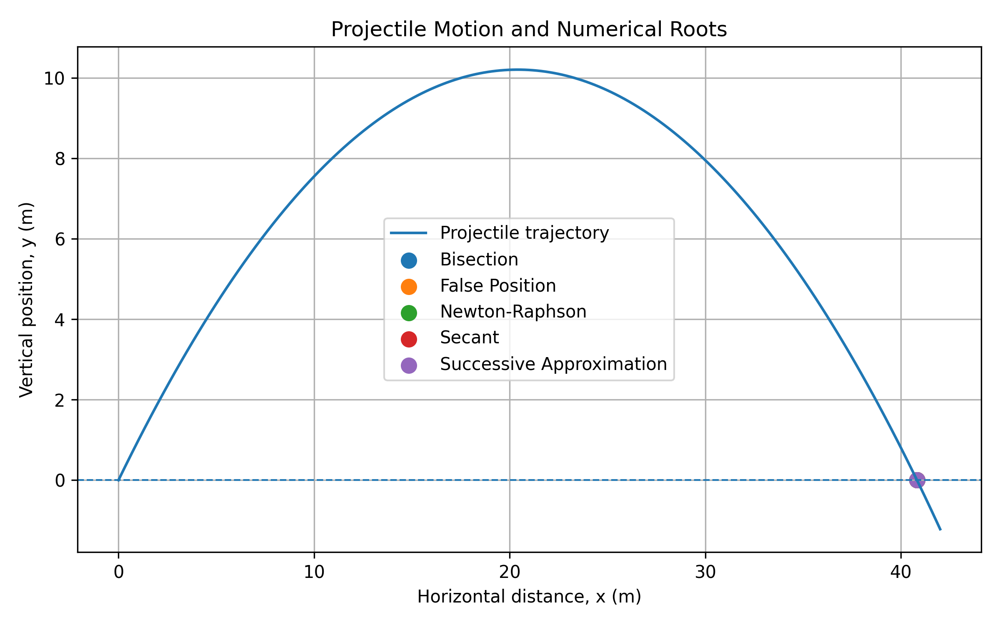
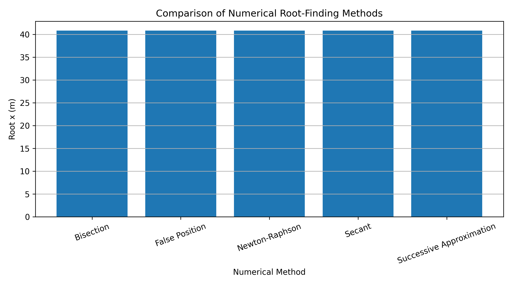

# Numerical Root-Finding Methods for Projectile Motion

## Overview

This project investigates and compares several numerical root-finding
methods by applying them to a projectile-motion problem.

The objective is to determine the horizontal distance at which the
projectile returns to the ground and to compare the numerical results
obtained using different root-finding algorithms.

## Numerical Methods

The following numerical methods are implemented:

- Bisection Method
- False Position Method
- Newton-Raphson Method
- Secant Method
- Successive Approximation (Fixed-Point Iteration)

## Physical Model

The projectile trajectory is described by

y(x) = x tan(theta) - gx^2 / (2v0^2 cos^2(theta))

where:

- x is the horizontal distance (m)
- y is the vertical position (m)
- v0 is the initial velocity (m/s)
- theta is the launch angle
- g is the gravitational acceleration (m/s^2)

The root of the function corresponds to the horizontal position
where the projectile returns to the ground.

## Parameters

| Parameter | Value |
|---|---:|
| Initial velocity | 20 m/s |
| Launch angle | 45° |
| Gravitational acceleration | 9.8 m/s² |
| Tolerance | 1 × 10⁻⁶ |
| Maximum iterations | 100 |

## Results

The numerical methods produce the following approximations for
the non-zero root of the projectile trajectory:

| Method | Root (m) |
|---|---:|
| Bisection | 40.815491 |
| False Position | 40.816326 |
| Newton-Raphson | 40.816327 |
| Secant | 40.816327 |
| Successive Approximation | 40.816327 |

The results show that all five methods converge to approximately
the same horizontal distance.

## Visualizations

### Projectile Motion

The projectile trajectory and the roots obtained using the
different numerical methods are shown below.

### Root Comparison

The numerical roots obtained using the five methods are compared
below.

## Project Structure

`text
numerical-root-finding-methods/
│
├── numerical_methods.py
├── plot_results.py
├── requirements.txt
│
├── figures/
    ├── projectile_motion.png
    └── root_comparison.png
